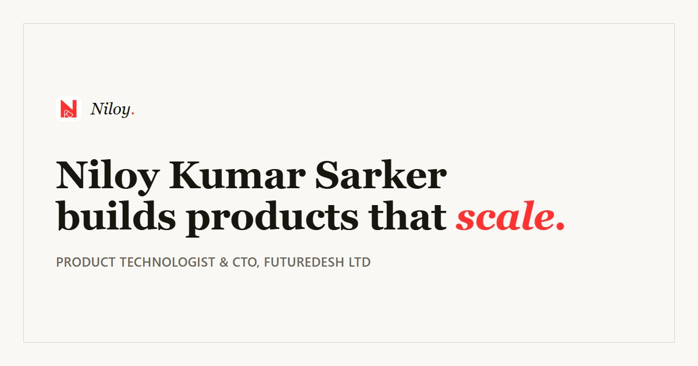

# Niloy Kumar Sarker | Product Technologist & CTO



> **Engineering at the intersection of product and technology.**  
> Building resilient, offline-first mobile systems and scalable digital ventures.

Live Portfolio: **[niloythings.com](https://niloythings.com)** _(Coming Soon)_

---

## 🚀 Overview

This is the official portfolio website for **Niloy Kumar Sarker**, designed to showcase specialized expertise in mobile engineering, product architecture, and enterprise-grade applications. 

The site is built with a **modern, minimal aesthetic** focusing on performance, accessibility, and fluid user interactions. It features a custom-built utility suite for developers and a detailed showcase of flagship products like **Futuredesh** and **Kormi**.

## 🛠️ Tech Stack

*   **Framework**: [Next.js 15 (App Router)](https://nextjs.org/)
*   **Language**: [TypeScript](https://www.typescriptlang.org/)
*   **Styling**: [Tailwind CSS](https://tailwindcss.com/)
*   **Animations**: [Framer Motion](https://www.framer.com/motion/)
*   **Icons**: [Lucide React](https://lucide.dev/)
*   **Deployment**: [Vercel](https://vercel.com/)

## ✨ Key Features

*   **Premium Dark UI**: A bespoke "Black & Red" aesthetic with glassmorphism effects.
*   **Fluid Animations**: Smooth page transitions and micro-interactions powered by Framer Motion.
*   **Developer Toolkit**: Built-in utilities including JSON Formatter, Base64 Encoder, and UUID Generator.
*   **Responsive Design**: Fully optimized for mobile, tablet, and ultra-wide desktops.
*   **Performance**: Static generation for lightning-fast load times.

## 🏃‍♂️ Getting Started

To run this project locally:

1.  **Clone the repository**
    ```bash
    git clone https://github.com/neelniloy/niloythings.git
    cd niloythings
    ```

2.  **Install dependencies**
    ```bash
    npm install
    ```

3.  **Run the development server**
    ```bash
    npm run dev
    ```

4.  Open [http://localhost:3000](http://localhost:3000) in your browser.

## 📦 Deployment

This project is optimized for deployment on **Vercel**:

1.  Push your code to GitHub.
2.  Import the project into Vercel.
3.  Vercel will automatically detect the Next.js configuration and deploy.

## 📫 Contact

*   **Email**: [contact@niloythings.com](mailto:contact@niloythings.com)
*   **LinkedIn**: [linkedin.com/in/niloythings](https://linkedin.com/in/niloythings)
*   **GitHub**: [@neelniloy](https://github.com/neelniloy)

---

© 2026 Niloy Kumar Sarker. All Rights Reserved.
